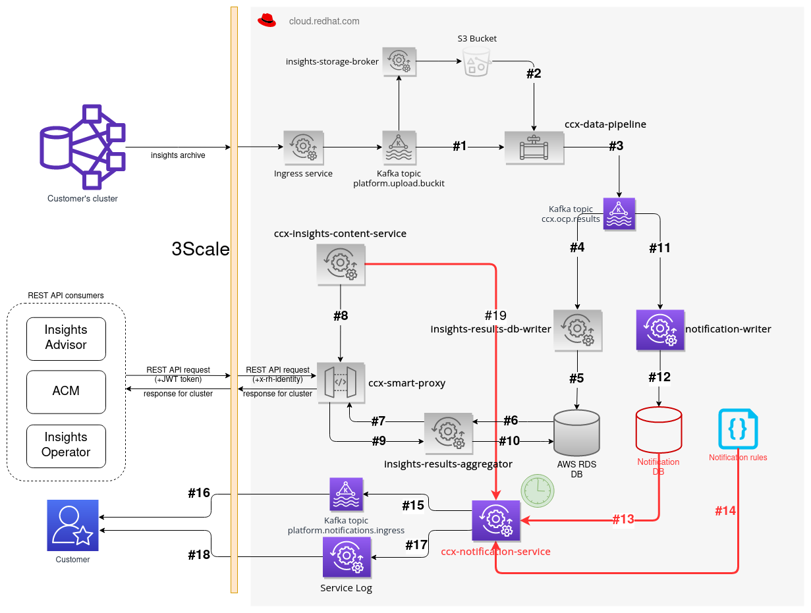
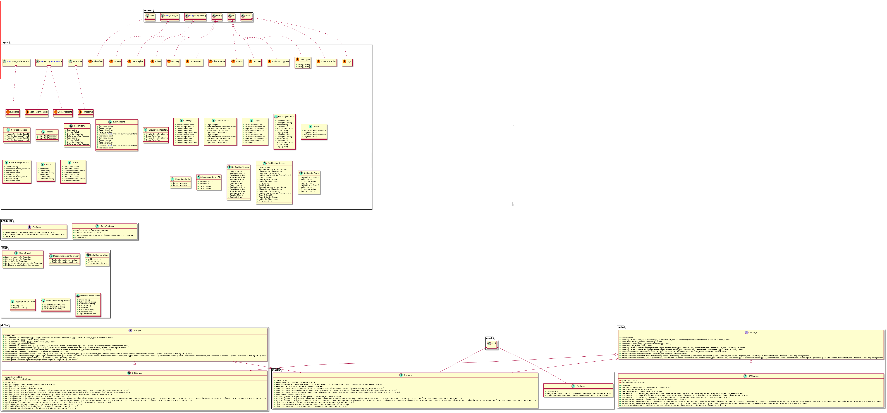
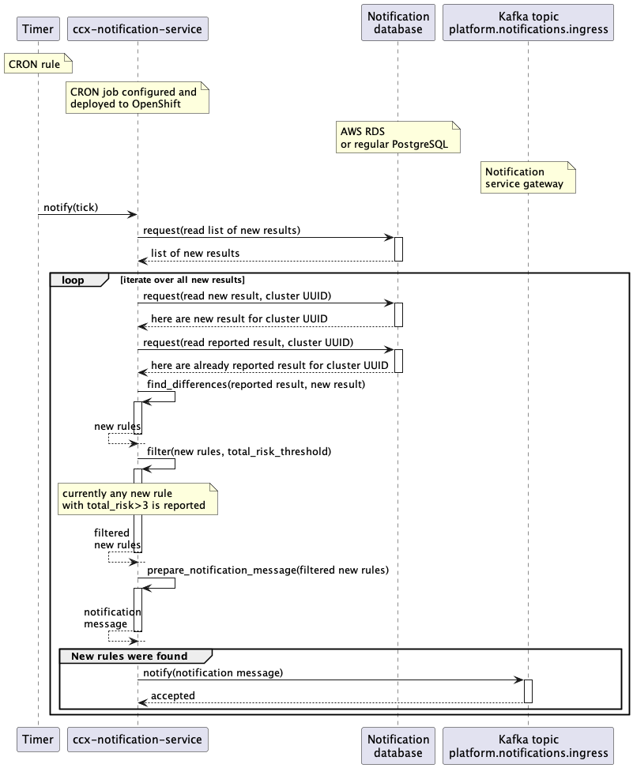

# Description

CCX Notification Service

## Architecture

[Architecture diagram, full scale](architecture_diagram.png)

## Data flow

The "end-to-end" data flow is described there (including Notification Writer service part):

1. A customer cluster with *Insights Operator* installed sends new data containing info about the cluster into *Ingress service*
1. The *Ingress service* consumes the data, writes them into an S3 Bucket, and produces a new message into a Kafka topic named `platform.upload.buckit`.
1. The *CCX Data pipeline* service consumes the message from the `platform.upload.buckit` Kafka topic.
1. That message represents an event that contains (among other things) an URL to S3 Bucket.
1. Insights operator data is read from S3 Bucket and *insights rules* are applied to that data in `ccx-data-pipeline` service.
1. Results (basically `organization ID` + `cluster name` + `insights results JSON`) are stored back into Kafka, but into different topic named `ccx.ocp.results`.
1. That results are consumed by `ccx-notification-writer` service.
1. `ccx-notification-writer` service stores insights results into AWS RDS database into `new_reports` table.
1. Content of that table is consumed by `ccx-notification-service` periodically.
1. Newest results from `new_reports` table is compared with results stored in `reported` table.
1. If changes (new issues) has been found, notification message is sent into Kafka topic named `platform.notifications.ingress`.
1. The newest result is stored into `reported` table to be used in the next `ccx-notification-service` iteration.

### Remarks

1. Steps 1 to  5 are shared with the CCX Data pipeline
1. Steps 7 and 8 are performed by `ccx-notification-writer` service.
1. Steps 9 to 12 are performed by `ccx-notification-service` service.

## Notification templates

Notification templates used to send e-mails etc. to customers are stored in different repository:
[https://github.com/RedHatInsights/notifications-backend/](https://github.com/RedHatInsights/notifications-backend/)

Templates used by this notification service are available at:
[https://github.com/RedHatInsights/notifications-backend/tree/master/backend/src/main/resources/templates/AdvisorOpenshift](https://github.com/RedHatInsights/notifications-backend/tree/master/backend/src/main/resources/templates/AdvisorOpenshift)

## Class diagram

[Class diagram, full scale](class_diagram.png)

## Sequence diagram for the whole pipeline

[Sequence diagram, full scale](sequence_diagram.png)

## Sequence diagram for instant reports

[Full scale](instant_reports.png)

## Sequence diagram for weekly reports

[Full scale](weekly_reports.png)

## Database description

* PostgreSQL database is used as a storage.
* Database description is available [here](./db-description/index.html)

## Documentation for source files from this repository

* [ccx_notification_service.go](./packages/ccx_notification_service.html)
* [conf/config.go](./packages/conf/config.html)
* [differ/comparator.go](./packages/differ/comparator.html)
* [differ/content.go](./packages/differ/content.html)
* [differ/differ.go](./packages/differ/differ.html)
* [differ/storage.go](./packages/differ/storage.html)
* [producer/producer](./packages/producer/producer.html)
* [producer/kafka_producer.go](./packages/producer/kafka_producer.html)
* [types/types.go](./packages/types/types.html)

## Documentation for unit tests files for this repository

* [conf/configuration_test.go](./packages/conf/configuration_test.html)
* [differ/comparator_test.go](./packages/differ/comparator_test.html)
* [differ/differ_test.go](./packages/differ/differ_test.html)
* [producer/producer_test.go](./packages/producer/producer_test.html)
* [tests/mocks/Producer.go](./packages/tests/mocks/Producer.html)
* [tests/mocks/Storage.go](./packages/tests/mocks/Storage.html)
